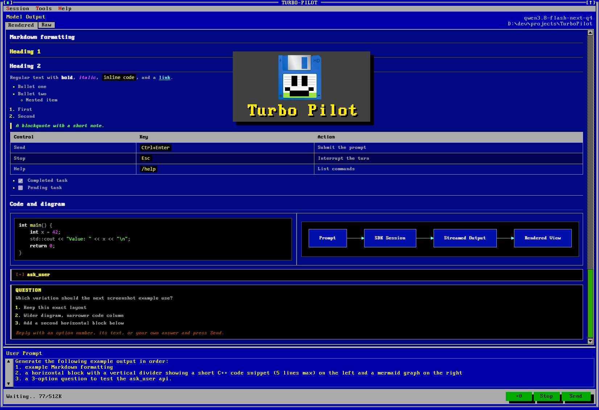
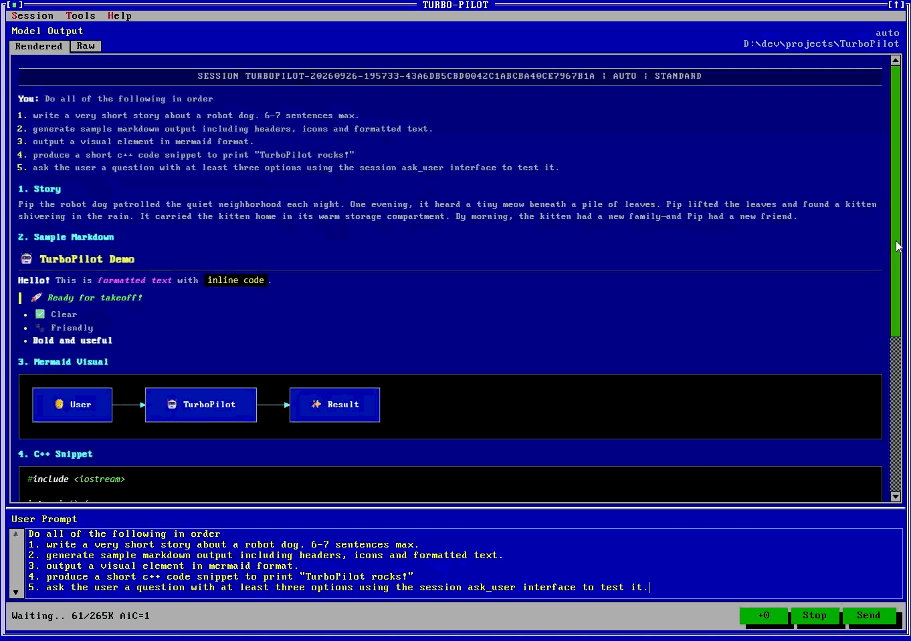

# TurboPilot

TurboPilot is a retro Windows 11 desktop client for large-language-model coding sessions. It provides streamed chat through the GitHub Copilot SDK or any OpenAI-compatible provider, including locally hosted models. It's modern development with a cozy DOS feel.

It answers the question: _"What if LLMs existed in 1992?"_




## Requirements

- Windows
- .NET 9 SDK or later
- WebView2 Runtime for Rendered output
- An authenticated Copilot CLI profile for cloud sessions, or an OpenAI-compatible endpoint for BYOK sessions

## Build and run

Initialize the theme submodule, then build the solution:

```powershell
git submodule update --init --recursive
dotnet build .\TurboPilot.sln
dotnet run --project .\src\TurboPilot
```

Start a session with **Session -> Begin Session**. Choose a workspace, provider, model, reasoning effort, and mode. Use **Ctrl+Enter** or **Send** to submit a prompt. Sending while a response is running interrupts that response before sending the new prompt.

TurboPilot displays streamed text in **Raw** and **Rendered** tabs. Rendered output supports Markdown, Mermaid diagrams, links, and local image previews. Questions and permission requests appear as reply cards; answer with a choice number, choice text, or the offered freeform response.

## Workspace tools

The **Tools** menu opens programs in the active workspace:

- **Open PowerShell** starts a shell with TurboPilot helper functions loaded.
- **Open Explorer** opens the workspace in File Explorer.
- **Open VSCode** opens the workspace with the `code` launcher.

## Commands

Type `/` in the prompt box to see available commands. Common commands include:

| Command | Action |
| --- | --- |
| `/help` | List commands |
| `/plan` | Show the current plan |
| `/attach` | Attach files to the next prompt |
| `/compact` | Compact the conversation context |
| `/reset` | Reset context while keeping session settings |
| `/session` | Begin or change the session |
| `/details` | Show active session settings |
| `/save` | Save the transcript |
| `/past` | Open saved sessions |

## Inline Prompt References

Type `[f` in the User Prompt area to choose from a list of pending file attachments and insert a reference like `[file:name]` to the prompt. Type `[s` to do the same using a list of enabled skills.

## Project context and instructions

When a new workspace contains a root `README.md` or `README.txt`, TurboPilot offers to attach it to an opening prompt. The prompt asks the model to understand the project and wait for instructions without changing files.

TurboPilot also appends the user-editable file below to new and resumed sessions:

```text
%LOCALAPPDATA%\TurboPilot\instructions\turbopilot.instructions.md
```

If the file does not exist, it is created from the bundled defaults. The defaults ask for Markdown responses, links, images, and Mermaid diagrams. Edit or empty the file to change those presentation instructions.

## Session management

- **Compact Context** summarizes the conversation without changing the visible transcript.
- **Reset Context** starts a fresh conversation with the same settings.
- **Past Sessions** lets you view, resume, or delete saved sessions. Use Ctrl or Shift to select multiple sessions for deletion.
- The active session cannot be deleted while it is running.
- Session summaries are generated when a session ends and shown in the Past Sessions list.
- Workspace changes are shown after each turn that modifies files. Files can be reviewed, compared, or reverted where Git history is available.

Sessions are stored under:

```text
%LOCALAPPDATA%\TurboPilot\sessions
```

Transcripts, rendered transcripts, and session metadata are saved separately. Provider credentials are not copied into session metadata.

## Regression checks

Run the dependency-free checks from the repository root:

```powershell
dotnet run --project .\tests\TurboPilot.Tests
```

Additional checks:

```powershell
dotnet run --project .\tests\TurboPilot.Tests -- --runtime --ui
```

- `--runtime` exercises the SDK runtime with a temporary loopback provider.
- `--ui` drives the WPF and WebView2 controls.
- `--session-features` checks links, workspace changes, and session hand-offs.
- `--ui-close` checks exit confirmation and cleanup.
- `--cloud` performs an optional authenticated cloud smoke test and may consume credits.

## Related Projects

TurboPilot was created using the [TurbolandWPF theme](https://github.com/mighty-studios/TurbolandWPF) and the [Github Copilot SDK](https://github.com/github/copilot-sdk)

## Licensing

### Source code

Copyright 2026 Mighty Studios, LLC.  
All rights reserved.

Licensed under the Apache License, Version 2.0 (the "License"); you may not use this file except in compliance with the License. You may obtain a copy of the License at

   http://www.apache.org/licenses/LICENSE-2.0

Unless required by applicable law or agreed to in writing, software distributed under the License is distributed on an "AS IS" BASIS, WITHOUT WARRANTIES OR CONDITIONS OF ANY KIND, either express or implied. See the License for the specific language governing permissions and limitations under the License.

See [LICENSE.md](LICENSE.md)

### Third-party font notice

This repository bundles the font **Px437 IBM VGA 9x16** by VileR.  
From [The Ultimate Oldschool PC Font Pack](https://int10h.org/oldschool-pc-fonts/),
used under [CC BY-SA 4.0](https://creativecommons.org/licenses/by-sa/4.0/).

The font is licensed separately under **CC BY-SA 4.0** and is not
covered by the Apache 2.0 license applied to this project's source code.

__Projects made using this Theme and the bundled Px437 IBM VGA 9x16 font should also credit VileR according to the CC BY-SA 4.0 terms__

## Artistic Dislaimer
This project is an independent, artistic tribute to the look of 1990s DOS text-mode IDEs. It is
not affiliated with nor endorsed by any IDE vendor who made similar looking commercial projects.

---  
  
>If you enjoy this project, please consider:

<a href="https://www.buymeacoffee.com/mighty_studios" target="_blank">
  
</a>

<small>(The joy I get from a free latte is incredible)</small> 

another output sample:
