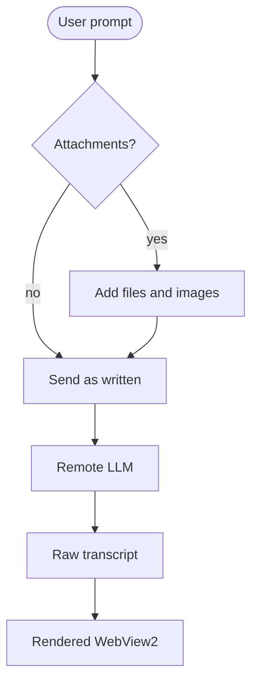
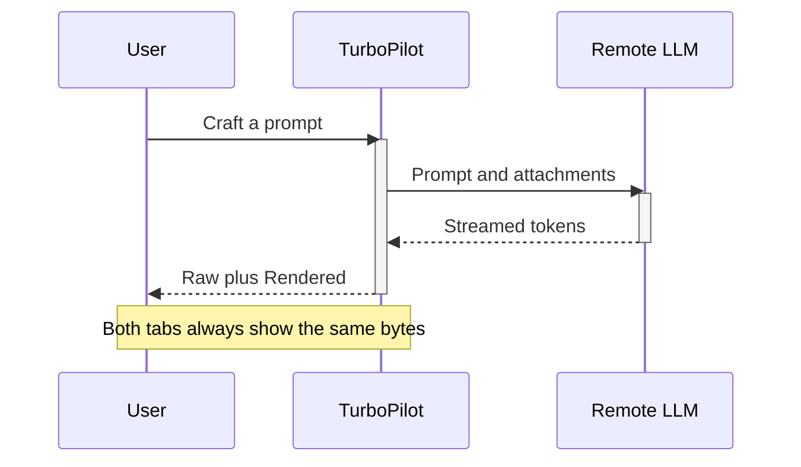
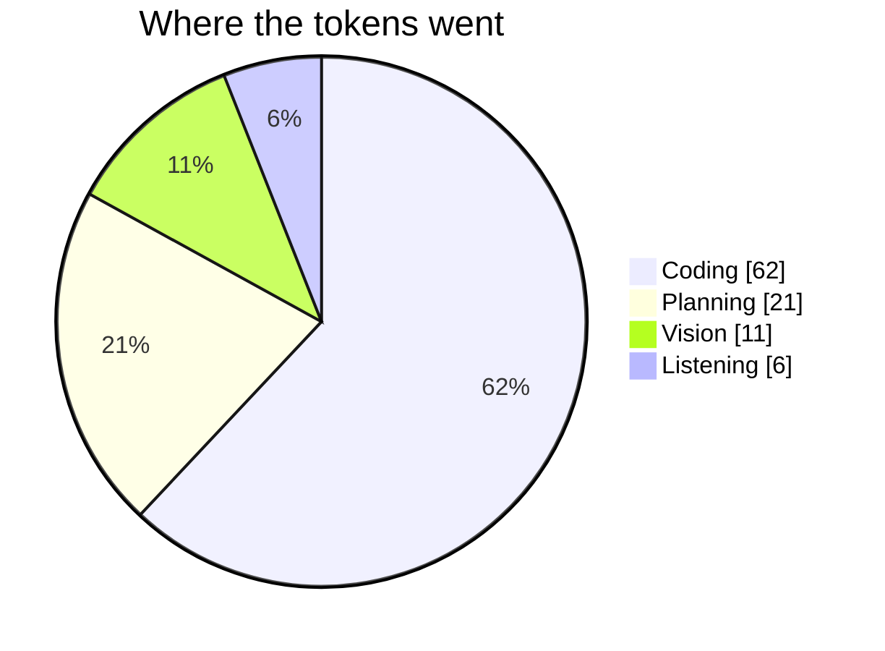

# TurboPilot Output Showcase

A sample transcript that exercises every themed element in both output
views. The **Raw** tab holds this text verbatim; the **Rendered** tab shows
the same bytes laid out by the Borland Vision theme. Replace this file's
contents once live transcript traffic takes over.

## 1. Headings

Headings step down the classic intensity ladder: yellow, white, cyan,
green, pink, then gray.

### H3 Cyan: section
#### H4 Green: subsection
##### H5 Pink: detail
###### H6 Gray: footnote

## 2. Inline styles 🎨

**Bold white** for the words that matter, *italic pink* for emphasis,
~~struck-through light red~~ for what the model dropped, and
`inline code` in yellow inside a black well. A keycap: <kbd>Ctrl</kbd> +
<kbd>Enter</kbd> sends the prompt.

> Block quotes are green and slanted, the way the help screens drew
> explanatory text. They carry a yellow left rule.

## 3. Links 🔗

- Web link: [TurboPilot on GitHub](https://github.com/mighty-studios/TurboPilot)
- File link (dotted rule, opens in the default editor):
  [README.md](kp-path:D%3A%5Cdev%5Cprojects%5CTurboPilot%5CTurboPilot%5CREADME.md)

## 4. Lists 📋

- Planning model
- Coding model
  - Vision model
  - Listening model

1. Pick a workspace
2. Pick a model per purpose
3. Send

Task list:

- [x] Dual output views
- [x] Raw is the source of truth
- [ ] Customization item details
- [ ] Session history browser

## 5. Code 🧪

```csharp
// Links a bare file name only when exactly one workspace file matches it.
using System.IO;

var options = new EnumerationOptions { RecurseSubdirectories = true };
var matches = Directory.EnumerateFiles(workspace, name, options)
    .Where(path => !path.Contains(@"\bin\") && !path.Contains(@"\obj\"))
    .Take(2)
    .ToList();

await File.AppendAllTextAsync(logPath, $"Found {matches.Count} match(es)\r\n");

string Link(string text)
{
    // Never guess between two candidates.
    return matches.Count == 1 ? $"[{text}](kp-path:{Uri.EscapeDataString(matches[0])})" : text;
}
```

## 6. Table 📦

| Purpose  | Model        | Host          | Streaming |
| -------- | ------------ | ------------- | :-------: |
| Planning | qwen3-8b     | Lemonade      |    Yes    |
| Coding   | gpt-4o       | Cloud         |    Yes    |
| Vision   | llama-3.2-vl | Local         |    No     |
| Listening| whisper      | Local         |    No     |

## 7. Diagrams 🤖







---

Status line: ready ⏱ Done ✅ Broken ❌ Careful ⚠️
